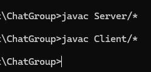
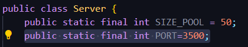
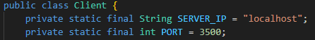
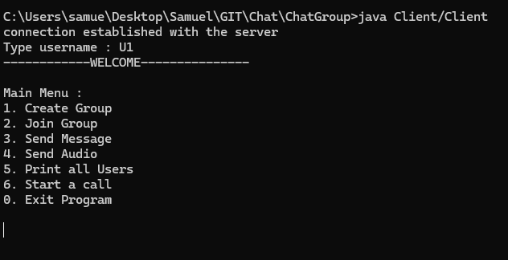
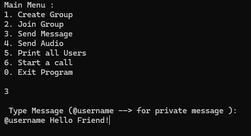
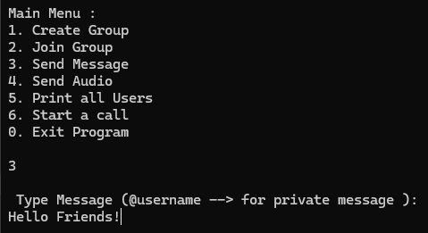
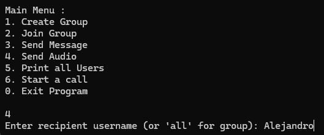
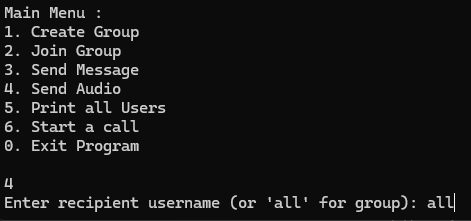
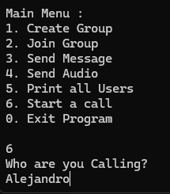

# ChatGroup

## Developer members
* Alejandro Muñoz

* Samuel Ibarra

* David Donneys

## Git Repository
https://github.com/lolito996/ChatGroup.git

## Description

*  this repository, implement a group chat using protocols such as TCP to be able to send messages and audios to clients who want to connect to our server. As well as being able to make in real time calls, sending audio as the speaker is talking. Possibly in the future we are willing to improve our methods of audio capture and audio transfer, so the audio is heard better.

## How to start our program

* Open the project, and enter the ChatGroup folder. There, you will be able to see the basic structure of the project, having folders as audios,images, Server, Client , as well as the README where this information is being provided.

**1)**
* We will compile our code: In cmd terminal, once you are located in ChatGroup folder, you will enter the next set of commands, in this order:

### javac Server/*

### javac Client/*

____

**2)**
* Then, after all classes has generated their respective .class file, we are ready to execute our program:
* First, execute the chat server on the respective host computer:

### java Server/Server

____

**3)**
* When server has given the confirmation message saying is running, all clients are ready to join! Proceed with the next command to execute the Client (have in mind that each client must have compiled the Client file previously, as in step 1) :

### java Client/Client

* The client user will know he has been connected to the server, when the username is aked from console.
s
____

## Aditional Notes:

* In case the server is running, but the client is not able to stablish a connection, make sure that both Server and Client PORT variable has the same value, we advice using 3500. You can close the port connection or you can change the PORT in this part of the Server code.

where it is shown underlined at the end of the line of code where the $3500$ is shown. You can change it for a new PORT. We suggest you use the $4500$ or a free PORT  .
___
* Also, make sure to have stablished the correct Server IP address from the client.

___
___
## Functionalities
* Now, let's talk about what a client can do to interact with other clients, as well as how they can do it. When a Client stablishes connection with the server, and enters a valid username, it will be displayed the main menu, giving the client the possible options:

## Client
* When a new Client.java is created, which will be the id that will be used to send the messages, provide a name, if that name already exists, it will give you an alert message that you cannot use a name that already exists.

## Group

* Each client is able to create groups, a client can create many groups but they can only join one group so if a client wants to join another group they will have to leave the group there is an option in the interface which is to join a group and they will be It will show all the groups that the clients have created.

**Option 1** 
* To create a group, user will enter option 1 from the main menu, then the user will have to enter a valid name of the new group.

**Option 2**
* If the user has not entered any group at the moment, selecting option 2 will provide him the line to enter which group will be entering. only having to type the name of any of the existing groups.

* If the user is already in a group, selecting option 2 will automatically make the user leave the current group they are in.
___

## Message
**Option 3**
* To be able to send a message you can do it privately or to the group you are joined to. If you want to send a message to the group, enter the message and send it.

* If you are going to send it privately to an specific user, you will need the notation **"@"** at the beginning of the message. Next to the **$@$** enter the user's name, separate and place the message
example: **$@$** samuel hello how are you?
and that message will be sent to the private message of the user samuel

**Private Message**

**Group Message**

## Message History
* The history for the messages will be saved in a txt file in the Server Host, where all the messages will be shown, the group messages and the private ones will be shown.

____
## Audio 

**Option 4**
* To send an audio is not complicated since it asks you the name of the user to whom you are sending the private audio or "all" if you want to send it to the group. It will be shown to the person or group who sent the audio and it will play automatically

**Private Audio**

**Group Audio**

* The sender has to press enter once the receiver username has been found. The recording will start, and the sender will have to press enter again to stop the recording, and send the final audio to the receiver user.

## Audio History

* The audio history will show all the audios in an AUDIOS folder saved in a .wav file

___
## Users

**Option 5**

* This option has been implemented so users know the names of the other clients connected to the server, being usefull at the moment when they want to send private messages, audios, or even calls.
___
## Call

**Option 6**

*This option provides the user the opportunity to select another user connected to the server, and send audio. The difference from normal audio notes from option 4, is that the receiver user, will be able to listen to the audio at the same time the sender is talking to the microphone. If the receiver user wants, they can start a call entering the first sender user, as the receiver, so both can talk like in a normal call!

* After entering the receivers username, the caller has to press enter to start the audio transfer, and pressing enter again, will close the call.

* Have in mind that this program has only implemented the call to one single user, not a complete group.

